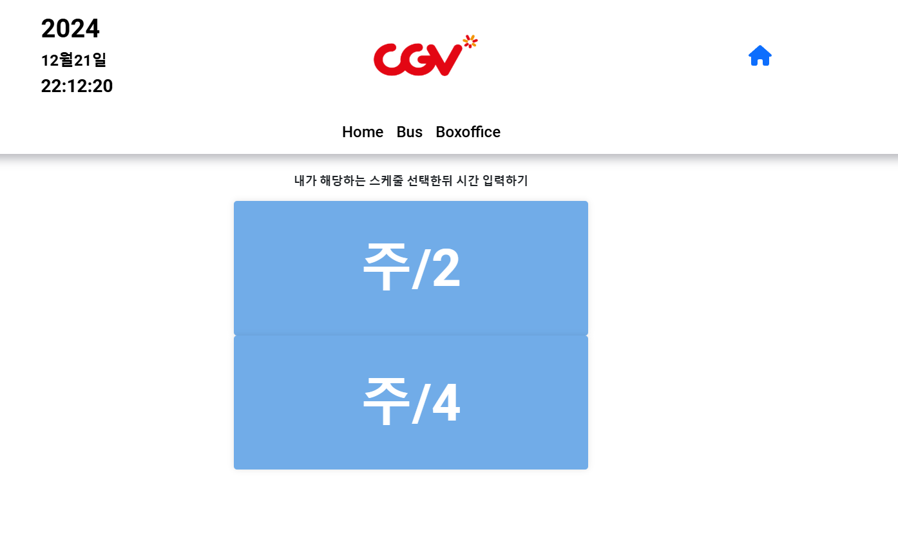

<!--
Hey, thanks for using the awesome-readme-template template.
If you have any enhancements, then fork this project and create a pull request
or just open an issue with the label "enhancement".

Don't forget to give this project a star for additional support ;)
Maybe you can mention me or this repo in the acknowledgements too
-->

  
  <h1>Part time Calculator</h1>

<h4>
    <a href="https://cgvparttime.netlify.app/">View Demo</a>
  </h4>

 

<!-- About the Project -->

## :star2: About the Project

  <h2 style="text-align:center">영화관 시간이 유동적으로 변함에 따라 출근시간도 계속 변동되어 알바생들의 혼란을 없애고자 계산기 기능을 제작</h2>
  
알바생들의 출근시간 계산을 자동화시켜 지각률을 낮추고, 매니저들의 스케줄 작성에 도움을 주기 위해 개발

  <ul>
    <li>마감 시간 입력시 출근시간 확인 가능</li>
    <li>일일 박스오피스 확인</li>
    <li>출근에 도움이 될 수 있는 실시간 버스 도착 정보 조회 기능 추가 (24.10.03)  -Open StreetMap API를 이용해서 맵에 정류장 좌표를 표시</li>

## :sparkles: structure

  

<!-- Screenshots -->

### :camera: Screenshots

 
  

<!-- TechStack -->

### :space_invader: Tech Stack

  

  
  
  
  
  

<!-- Env Variables -->

### :key: Environment Variables

To run this project, you will need to add the following environment variables to your .env file

`REACT_APP_KOBIS_API_KEY`

`REACT_APP_KOREA_FILM_KEY`

`REACT_APP_BUS_API_KEY`

<!-- Acknowledgments -->

## :gem: Acknowledgements

- [Kmdb](https://www.kmdb.or.kr/info/api/apiList)
- [kofic](https://www.kobis.or.kr/kobisopenapi/homepg/main/main.do)
- [openstreetmap](https://wiki.openstreetmap.org/)
