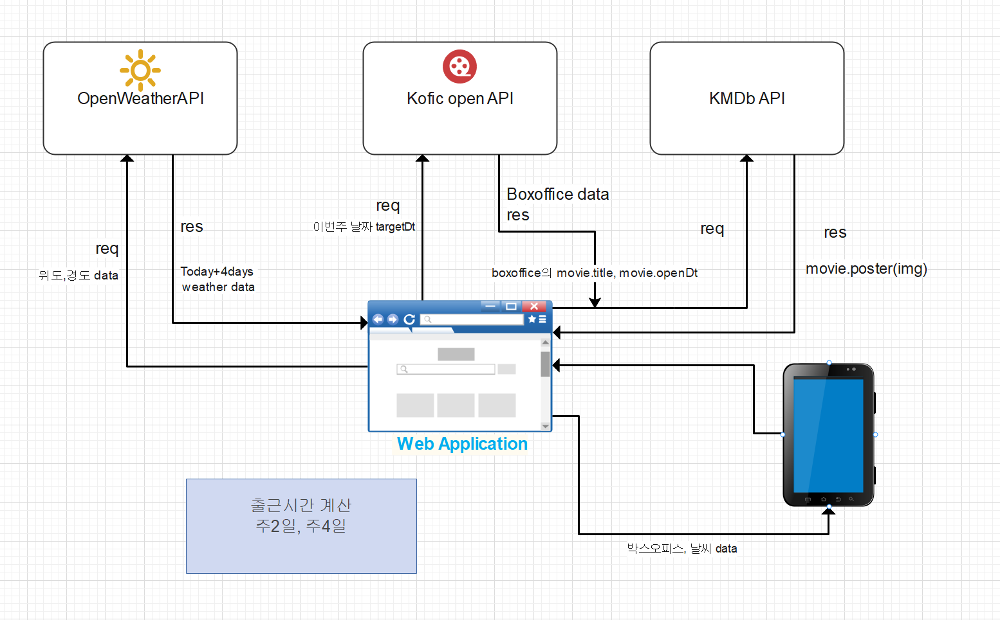

# Project 목표

영화관 시간이 유동적으로 변함에 따라 출근시간도 계속 변동되어 알바생들의 혼란을 없애고자 계산기 기능을 제작,
시간을 확인하는 잠깐의 시간동안 얻을 수 있는 정보가 무엇이 있을까 생각해본 결과,
현재 개봉작들과 버스를 이용하는 인원이 많아 버스 도착정보를 알 수 있는 기능 추가

알바생들의 출근시간 계산을 자동화시켜 지각률을 낮추고, 매니저들의
스케줄 작성에 도움을 주기 위해 개발하게 됐습니다.

## 아키텍쳐



## 실행 방법

1. 이 저장소를 클론합니다:

   ```bash
   git clone https://github.com/Hyun198/portfolio_partTime.git
   ```

2. 프로젝트 폴더로 이동합니다:

3. 필요한 패키지를 설치합니다:

   ```bash
   npm install
   ```

4. 웹을 실행시킵니다:

   `npm start`

5. 사용한 API

   kofic open api 'https://www.kobis.or.kr/kobisopenapi/homepg/main/main.do'

   KMDB api 'https://www.kmdb.or.kr/main

   +---------------------추가사항

   경기도 버스 노선 API 'https://www.data.go.kr/'  
   메인 페이지에 버스 노선 정보, 정류장 도착정보 적용

   +---------------------변경사항

   OpenWeatherAPI 를 이용한 weather component 메인 페이지에서 사용 중단 (사용자들이 별로 필요한 기능이랑 생각하지 않아서 수정)

## Project 결과

현재 계산기 기능, 버스 api를 이용한 정류소 도착정보, 개봉작들의 정보 구현
But, 날씨 api도 이용해 정보를 불러왔지만, 직접 웹을 사용해보면서 필요 없는 기능이라 판단하여 사용을 중단했다.
웹 디자이너와 개인적으로 협업할 기회가 없어, UI디자인이 부족하다는 점이 있다.

## 현재 배포된 사이트

[CGV Part-time Job](https://cgvparttime.netlify.app/)
